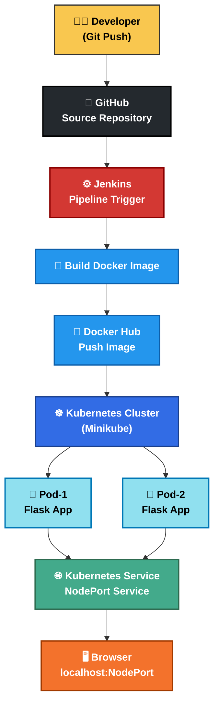

# python-project
This is My Python Project Flowchart 

```mermaid
flowchart TD
    A["👨‍💻 Developer<br/>(Git Push)"]
    B["🐙 GitHub<br/>Source Repository"]
    C["⚙️ Jenkins<br/>Pipeline Trigger"]
    D["🐳 Build Docker Image"]
    E["🐳 Docker Hub<br/>Push Image"]
    F["☸️ Kubernetes Cluster<br/>(Minikube)"]
    G["🔵 Pod-1<br/>Flask App"]
    H["🔵 Pod-2<br/>Flask App"]
    I["🌐 Kubernetes Service<br/>NodePort Service"]
    J["🖥️ Browser<br/>localhost:NodePort"]

    A --> B --> C --> D --> E --> F
    F --> G
    F --> H
    G --> I
    H --> I
    I --> J

    classDef dev fill:#f9c74f,stroke:#333,stroke-width:2px,color:#000,font-weight:bold
    classDef github fill:#24292e,stroke:#000,stroke-width:2px,color:#fff,font-weight:bold
    classDef jenkins fill:#d33833,stroke:#8b0000,stroke-width:2px,color:#fff,font-weight:bold
    classDef docker fill:#2496ed,stroke:#0d5faa,stroke-width:2px,color:#fff,font-weight:bold
    classDef k8s fill:#326ce5,stroke:#1a3f8c,stroke-width:2px,color:#fff,font-weight:bold
    classDef pod fill:#90e0ef,stroke:#0077b6,stroke-width:2px,color:#000,font-weight:bold
    classDef svc fill:#43aa8b,stroke:#2d6a4f,stroke-width:2px,color:#fff,font-weight:bold
    classDef browser fill:#f3722c,stroke:#a13a00,stroke-width:2px,color:#fff,font-weight:bold

    class A dev
    class B github
    class C jenkins
    class D,E docker
    class F k8s
    class G,H pod
    class I svc
    class J browser
```
